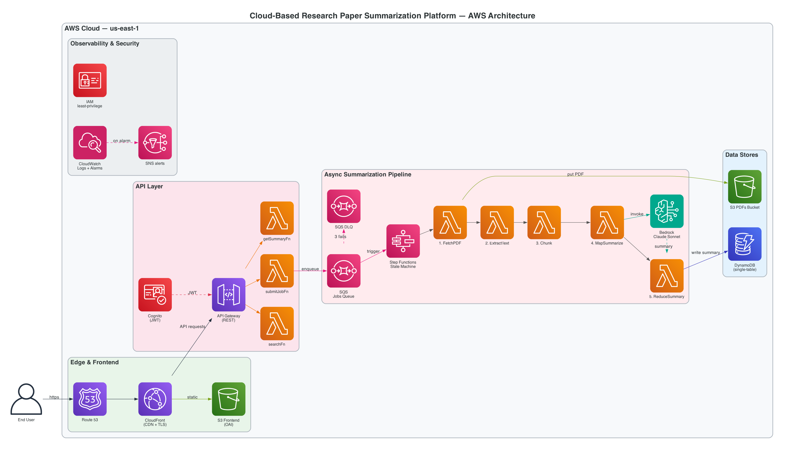

# Research Paper Summarizer

[](https://github.com/pmxlr8/research-summarizer/actions/workflows/ci.yml)
[](https://d24irdkbe9jj2b.cloudfront.net)
[](docs/Final_Report.pdf)

A serverless AWS platform that searches arXiv and Semantic Scholar, fetches full-text PDFs, and produces structured summaries (Objectives, Methodology, Results, Limitations, Contributions) using a large language model on Amazon Bedrock. On top of every summary you can chat with the paper (RAG with cited chunks), explore an auto-extracted knowledge graph of entities and relationships, and discover similar papers from your own library.

> NYU Cloud Computing, Spring 2026

**Live demo:** https://d24irdkbe9jj2b.cloudfront.net
**Status:** v1.0 in production. ~30s end-to-end summary, ~$0.20 per paper, $0 idle.

## Demo

[](https://youtu.be/jnWQbBjZMes)

▶ **[Watch the 4-minute demo on YouTube](https://youtu.be/jnWQbBjZMes)**

## Final Report

The full IEEE-format report (8 pages, two-column, 7 figures) is at **[docs/Final_Report.pdf](docs/Final_Report.pdf)**. Sections cover problem statement, motivation, related work, system architecture, architectural properties (microservices, scalability, reliability, latency, data storage, data pipeline), retrieval-augmented features, evaluation, and future work.

## Team

| Member | Ownership Area |
|---|---|
| Pranjal Mishra | Architecture, frontend (Next.js), AWS CDK, ops layer, RAG chat, knowledge graph |
| Yang Zheng | Search Lambda, arXiv client, integration tests |
| Shreyas Sankpal | Pipeline & Orchestration |
| Kerry Huang | Auth & API |

## Features

- **Search** across arXiv + Semantic Scholar in parallel, deduped by arxivId / DOI / normalized title
- **Five-section structured summary** generated by an SQS-triggered Step Functions pipeline (Fetch → Extract → Chunk → MapSummarize → ReduceSummary)
- **Talk-to-PDF (RAG chat)** — questions answered from the paper's chunks with inline citation tooltips
- **Knowledge graph** — typed entities and relationships extracted from the structured summary, rendered with React Flow (key-concepts rail, click-through neighbours, regenerate option)
- **Related papers** — top-3 similar papers from your library by cosine similarity over paper-level mean embeddings
- **Export** — copy as Markdown, download .md, download BibTeX
- **Per-user quota + content-hash dedup** — caps spend; submitting a paper that's already been summarized for any user returns the cached result instantly
- **Cognito auth** with email verification, SRP login, and forgot-password flow
- **Operational layer** — CloudWatch dashboard, four alarms wired to SNS email, X-Ray distributed tracing on every Lambda, AWS Budgets alarm at $50/month

## Architecture



Six CDK stacks:

| Stack | Resources |
|---|---|
| `Auth` | Cognito user pool + SPA client |
| `Data` | DynamoDB single-table + GSI1 + S3 PDFs bucket (90-day lifecycle) |
| `Pipeline` | SQS + DLQ + Step Functions state machine + 6 Lambdas |
| `Api` | API Gateway REST + Cognito JWT authorizer + 9 handler Lambdas |
| `Frontend` | Private S3 + CloudFront with path-rewriter Function |
| `Ops` | SNS + 4 CloudWatch alarms + Budgets + Dashboard |

LLM surface is **Amazon Bedrock**: Qwen 3 Next 80B for the high-volume map-reduce summarization, Claude Sonnet 4.6 for chat and knowledge graph extraction, and Titan Text Embeddings v2 for chunk vectors.

## Numbers

| | |
|---|---|
| End-to-end summary | **27–50 s** on real arXiv papers |
| Marginal cost | **~$0.20 / paper** (dominated by Bedrock tokens) |
| Idle monthly cost | **$0** (everything except Bedrock fits the AWS free tier) |
| DLQ messages | **0** across the deployment |
| Unit tests | **14**, all passing |

## Repository Layout

```
research-summarizer/
├── apps/
│   ├── web/                        # Next.js 14 frontend (TypeScript + Tailwind)
│   │   ├── app/                    # Pages, route handlers, components
│   │   ├── lib/                    # Auth, API client, search history, types
│   │   └── data/                   # Mock data for offline dev
│   └── api/                        # Lambda handler code
│       ├── handlers/               # search, submit-job, get-summary, list-summaries,
│       │                           # get-quota, get-related, get-graph, chat
│       ├── handlers/pipeline/      # fetch-pdf, extract-text, chunk, map-summarize,
│       │                           # reduce-summary, trigger
│       ├── lib/                    # arxiv, semantic-scholar, bedrock, ddb, s3, ...
│       └── tests/                  # 14 vitest tests
├── infra/                          # AWS CDK
│   ├── bin/app.ts
│   └── lib/                        # auth, data, pipeline, api, frontend, ops stacks
├── docs/
│   ├── Final_Report.md             # Source for the IEEE final report
│   ├── Final_Report.pdf            # Compiled IEEE-style PDF (8 pages, 7 figures)
│   ├── presentation/               # 8-slide deck (HTML + PPTX)
│   ├── ieee.css                    # IEEE two-column stylesheet for weasyprint
│   ├── figures/                    # UI screenshots embedded in the report
│   ├── diagrams/                   # Architecture diagrams (PNG + SVG)
│   ├── reports/                    # Week 2 report, upgrade proposal, execution guide PDFs
│   └── source/                     # Markdown source for the PDFs in reports/
├── scripts/deploy.sh               # One-command deploy
└── .github/workflows/ci.yml        # Lint + build on every PR
```

## Local Development

```bash
cd apps/web
npm install
npm run dev   # http://localhost:3000 — uses mock data without AWS credentials
```

## Deployment

```bash
cd infra
npm install
npx cdk synth          # generate CloudFormation, no AWS calls
npx cdk diff           # changes vs the deployed stack
# npx cdk deploy --all # don't run without team alignment
```

`scripts/deploy.sh` is a one-command wrapper that bootstraps, deploys all six stacks, builds the frontend with the resulting Cognito + API config baked in, uploads to S3, and invalidates the CloudFront cache.

## Tech Stack

- **Language**: TypeScript 5.x
- **Frontend**: Next.js 14 (static export), Tailwind CSS, React Flow + dagre for the knowledge graph
- **Infrastructure**: AWS CDK v2
- **Runtime**: Node.js 20 LTS on Lambda
- **LLM**: Qwen 3 Next 80B + Claude Sonnet 4.6 (Amazon Bedrock); Titan Text Embeddings v2
- **CI/CD**: GitHub Actions

## Cost Posture

Idle infrastructure cost is **$0**. Every component except Bedrock fits the AWS free tier; Bedrock is pay-per-token at roughly **$0.20 per paper** (dominated by the map-reduce summarization). Content-hash dedup means repeat submissions of the same paper are free. AWS Budgets alarm fires at 80 % of the $50/month ceiling.

## Documentation

| File | What |
|---|---|
| [`docs/Final_Report.pdf`](docs/Final_Report.pdf) | IEEE-style final report (8 pages, two-column, 7 figures) |
| [`docs/Final_Report.md`](docs/Final_Report.md) | Markdown source for the final report |
| [`docs/presentation/Presentation.pptx`](docs/presentation/Presentation.pptx) | 8-slide presentation deck |
| [`docs/diagrams/`](docs/diagrams/) | Architecture diagrams (PNG + SVG, landscape + portrait) |
| [`docs/figures/`](docs/figures/) | UI screenshots embedded in the report |
| [`docs/reports/`](docs/reports/) | Week 2 report, team upgrade proposal, execution guide PDFs |
| [`docs/source/`](docs/source/) | Markdown source for the PDFs in `docs/reports/` |
