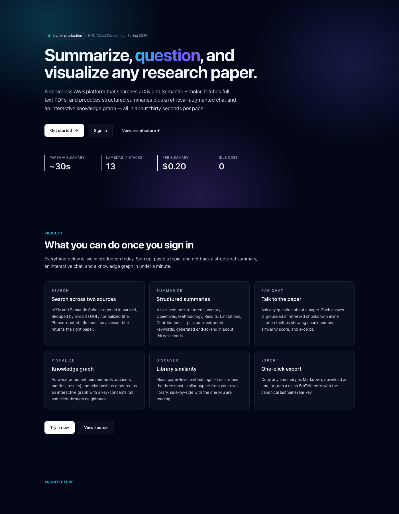
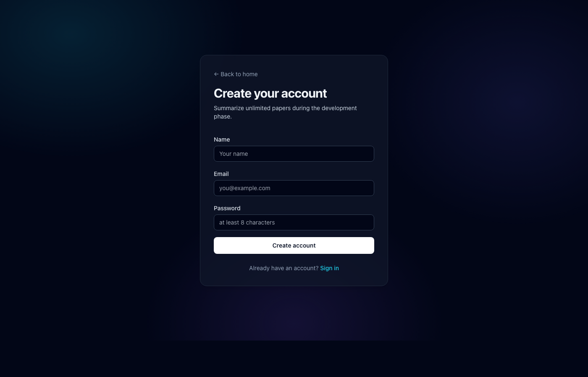
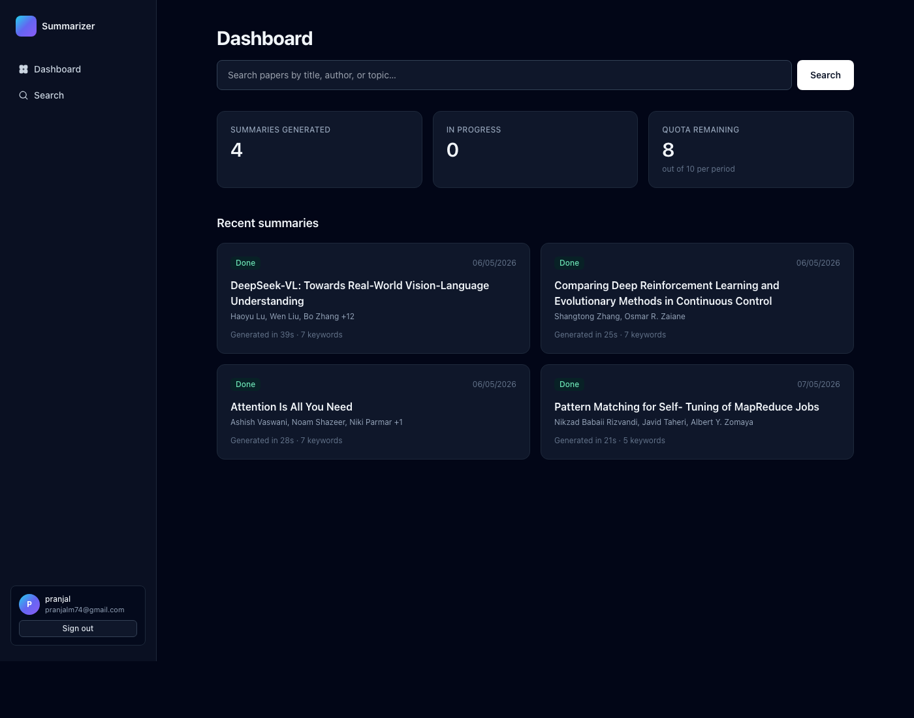
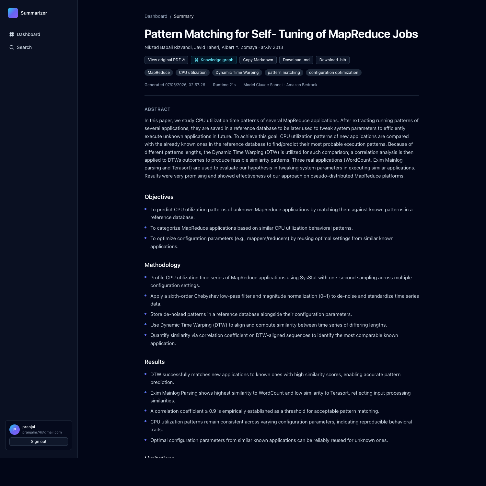
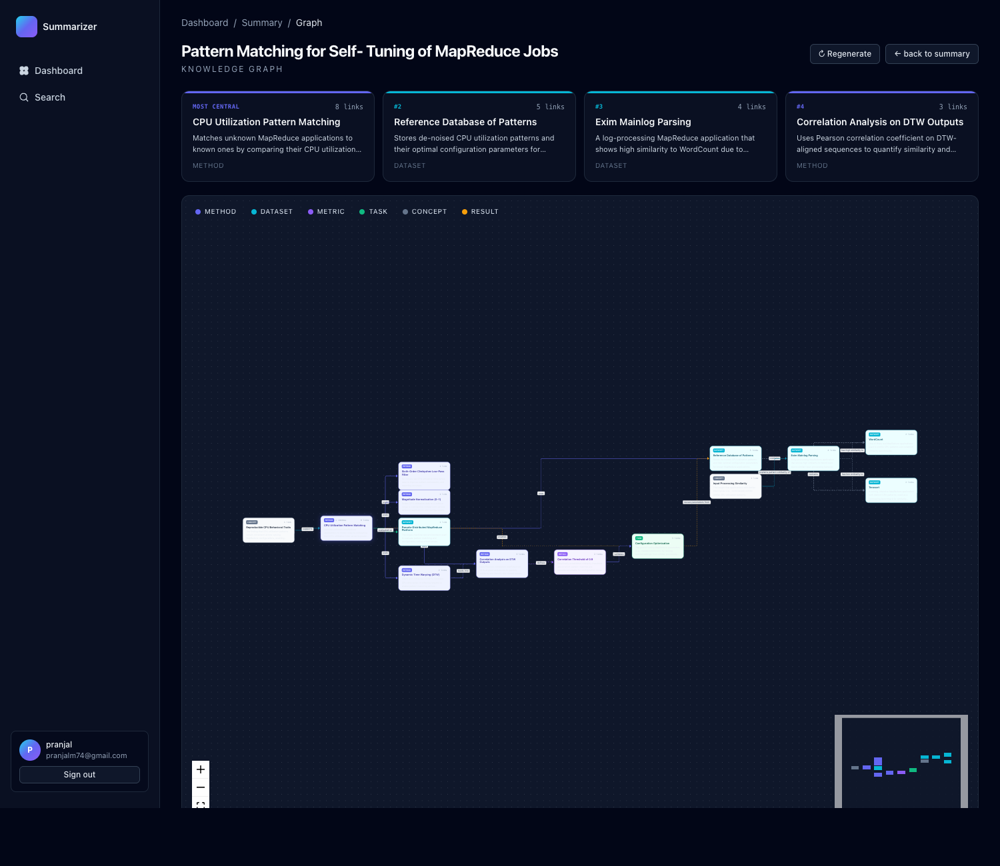
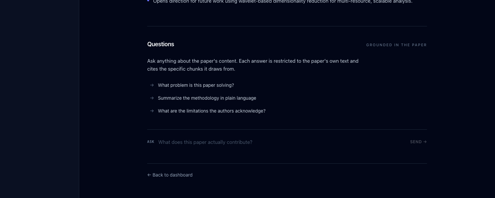

# Abstract

Researchers face an ever-growing volume of academic literature, and triaging which papers deserve a full read is itself a costly cognitive task. We present a cloud-native platform that searches open-access repositories (arXiv and Semantic Scholar), retrieves full-text PDFs, and produces structured summaries covering objectives, methodology, results, limitations, and contributions, generated by a large language model on Amazon Bedrock. On top of summarization, the system supports retrieval-augmented question answering against the paper's own content, similarity-based discovery of related papers in the user's library, and an interactive knowledge graph that visualizes typed entities and relationships extracted from each summary. The system follows a serverless, event-driven micro-services design on Amazon Web Services. Fifteen single-purpose Lambda functions communicate exclusively through API Gateway, Amazon SQS, and AWS Step Functions, with persistent state held in Amazon DynamoDB and Amazon S3. The deployed system summarizes a typical academic paper end-to-end in 27 to 44 seconds at an average marginal cost of 0.20 USD per paper, with zero idle infrastructure cost. We discuss the design choices that produce this performance profile, evaluate the system on real arXiv submissions, and outline natural next extensions.

**Index Terms**: serverless computing, event-driven architecture, large language models, retrieval-augmented generation, knowledge graphs, AWS, Step Functions, microservices.

# I. Introduction

The rate of submission to open-access repositories has roughly doubled in the past decade, with arXiv now indexing over 2.4 million preprints. Active researchers, students, and practitioners therefore face a triage problem: given a research question, which subset of the literature is worth reading in full? Existing tools partially address this. Search engines surface relevant titles and abstracts, citation graphs reveal influence, and general-purpose chat assistants will summarize a paper if the user pastes its text. None of these tools, taken individually, supply an end-to-end workflow that combines authenticated multi-source search, automated full-text retrieval, persistent structured summaries, retrieval-grounded question answering, and a visualization of the paper's conceptual structure, all delivered with the cost discipline a sustained academic workload requires.

This paper describes the design and implementation of such a platform. Our contributions are: (1) a serverless reference architecture for asynchronous LLM-driven document processing on AWS, (2) a concrete account of the trade-offs that produced single-digit-second user-visible latencies and zero idle cost, and (3) the integration of three distinct retrieval features (chat, related-papers ranking, and a knowledge graph) on top of a single shared embedding store, illustrating how a small piece of infrastructure (chunk vectors in DynamoDB) supports a broad range of downstream capabilities.

The remainder of the paper is organized as follows. Section II states the problem precisely and Section III articulates the motivation. Section IV discusses related work. Sections V and VI describe the system architecture and the architectural properties (scalability, reliability, latency, data storage, data pipeline, microservices) that the design satisfies. Section VII covers the retrieval-augmented features that go beyond summarization. Section VIII reports evaluation results and screenshots from the live deployment, Section IX summarizes the delivered feature set, Section X discusses future work, and Section XI concludes.

# II. Problem Statement

We define the problem the platform solves through three concrete user goals. First, given a topic of interest in natural language (for example, "transformer models in healthcare"), the user expects a ranked list of recent, relevant papers drawn from at least two independent open-access sources. Second, given a chosen paper, the user expects a structured summary, returned within roughly one minute, that covers the paper's objectives, methodology, results, limitations, and contributions in bullet form. Third, after reading the structured summary, the user expects to ask follow-up questions in natural language and receive answers that are demonstrably grounded in the paper's text rather than the LLM's general knowledge.

The system additionally targets two operational goals that are particular to a class project. The platform must run on a publicly available cloud provider (AWS) using only managed services, so that the entire stack is reproducible from infrastructure-as-code. The system must also fit within a small monthly budget, with idle infrastructure cost approaching zero, so that no traffic over a quiet weekend produces no bill.

# III. Motivation

The motivation is twofold. First, the structured five-section format we adopt for summaries (objectives, methodology, results, limitations, contributions) corresponds closely to the framework an experienced reader uses when judging a paper's relevance. Producing this format consistently, across thousands of papers in different subfields, is exactly the kind of repetitive cognitive task that generative AI can absorb at low marginal cost. Second, the engineering challenge underlying such a platform (long-running asynchronous LLM calls, parallel chunk processing, fault-tolerant orchestration, observability, and cost control) exercises the core themes of a cloud computing curriculum. Building this platform required us to make explicit decisions on serverless compute boundaries, queue-based versus state-machine orchestration, single-table NoSQL data modeling, and per-user quota enforcement, each of which surfaces a trade-off worth recording.

# IV. Related Work

We identified four categories of existing solution and evaluated where each falls short.

**Search engines** (Google Scholar, Semantic Scholar's web UI, arXiv's native search) excel at surfacing relevant papers but provide no summarization. The user must still read the full text or rely on the abstract.

**General-purpose chat assistants** (ChatGPT, Claude.ai) summarize a paper effectively when given the text, but the user must paste or upload it manually. Outputs are unstructured, ephemeral, and uncached, so there is no compounding benefit from repeated use, no cross-paper analysis, and no per-user cost discipline.

**Paper-specific commercial tools** (SciSpace, Elicit, Scite Assistant) are the closest competitors. They offer summarization and chat, but they are proprietary closed systems with opaque cost models, primarily targeting deep-pocketed institutional users, and they do not expose the underlying infrastructure for customization.

**Self-hosted summarization scripts** (Hugging Face pipelines, LangChain templates) require the user to provision and run the entire stack, and lack authentication, persistence, multi-source search, and an operational layer.

Our system sits in the gap between these categories. It combines authenticated multi-source search, structured summarization, persistent per-user history, content-level deduplication across users, per-user quota, full observability, and reproducible cloud deployment. The platform is built as a class deliverable rather than a commercial product, but every component is real production code, deployed on a real AWS account, and verified by live traffic.

# V. System Architecture

The platform is organized as fifteen Lambda-backed microservices, two managed queues, an event-driven orchestrator, three managed data stores, and an edge layer. All resources are provisioned reproducibly with the AWS Cloud Development Kit (CDK) in TypeScript. Figure 1 shows the deployed topology.

<figure class="span">

<figcaption>Fig. 1. System architecture. CloudFront fronts a private S3 frontend bucket and forwards dynamic traffic to API Gateway. Cognito authorizers gate every API route. The "submit job" handler enqueues to SQS; a trigger Lambda starts a Step Functions execution that orchestrates Fetch, Extract, Chunk, parallel MapSummarize, and Reduce stages. DynamoDB holds jobs and chunk embeddings; S3 holds PDFs and intermediate text. Bedrock serves both text generation and Titan v2 embeddings.</figcaption>
</figure>

The architecture decomposes by lifecycle, with each tier addressing a different concern.

## A. Edge layer

Amazon Route 53 resolves the application domain. Amazon CloudFront terminates TLS at the edge, caches static frontend assets, and forwards dynamic API requests to API Gateway. A small CloudFront Function attached to the viewer-request event rewrites directory-style URLs (for example, "/signup/") to their S3 keys ("/signup/index.html") and maps every dynamic "/app/summary/{id}/" URL to a single pre-rendered placeholder page. The React component then reads the actual identifier from window.location at runtime. This avoids paying for a server-side rendering layer, while preserving deep linkability.

We chose CloudFront over direct S3 hosting because S3 cannot terminate TLS on a custom domain, has no edge caching, and provides no DDoS protection. CloudFront supplies all three at no additional fixed cost when we keep the price class to PRICE_CLASS_100 (US and EU edges only).

## B. Authentication layer

Amazon Cognito User Pool manages signup, email verification, login, and JWT issuance. The web client uses the Secure Remote Password (SRP) protocol, so passwords are never transmitted in plaintext. After login, the browser stores the JWT in localStorage and presents it as the Authorization header on every API request.

API Gateway runs a built-in Cognito Authorizer in front of every protected route. Unauthenticated requests are rejected before any Lambda is invoked, eliminating one class of security mistake (forgetting to validate a token in a handler) and saving compute by not warming Lambdas for invalid traffic. Cognito also provides a self-service forgot-password flow that we expose through a two-step page (request code, then confirm code with new password).

## C. Synchronous API layer

Amazon API Gateway exposes a REST endpoint that routes to nine Lambda handlers, each implementing one operation: health check, search, submit job, list summaries, get one summary, get user quota, get related papers, get knowledge graph, and chat. The "submit job" handler also enforces per-user quota and content-hash deduplication before accepting work.

We deliberately deployed a fleet of small Lambdas rather than a single monolithic backend. The blast radius of a defect is contained to one operation; each function has its own log group, IAM role with minimum permissions, and bundling unit; and Lambda's automatic concurrency scaling applies per function rather than competing for one shared pool. The cost of this design is some duplication in helper code, which we contained by sharing a single TypeScript library (apps/api/lib/) bundled into each function with esbuild.

## D. Asynchronous summarization pipeline

When a user submits a paper, the synchronous API would block for tens of seconds if it produced the summary inline. We decouple the request from the work using Amazon SQS. The submit handler writes a job record to DynamoDB and enqueues a message containing the job identifier and paper metadata, then returns HTTP 202 with the job identifier in well under a second.

A small "trigger" Lambda subscribes to the SQS queue. For each message, it starts a single execution of an AWS Step Functions state machine, naming the execution after the job identifier so duplicate redrives never start a second execution. The state machine orchestrates five sequential states: FetchPDF, ExtractText, Chunk, MapSummarize, and ReduceSummary. The fourth state is a parallel Map that fans out one Lambda invocation per chunk, with concurrency capped at five so that we stay under our Bedrock model's tokens-per-second quota. The reduce state then combines the per-chunk JSON outputs into a single paper-level summary, computes the average chunk embedding, and persists everything to DynamoDB.

We chose Step Functions over a single fat Lambda for three reasons. First, Lambda has a hard fifteen-minute execution timeout. A 30-page paper that requires 12 parallel chunk summarizations and one reduction can exceed this. Second, Step Functions externalizes retries. If a single chunk's Bedrock call is throttled, that one chunk is retried with exponential backoff while the other 11 succeed once and only once. Third, the state machine produces a visual execution graph that is invaluable when debugging a failure. A separate "MarkFailed" state catches any uncaught error from any prior state, captures the cause string, and updates the DynamoDB job record to status "failed" with the error message. The user sees a clean failure with a reason rather than a job stuck in "running" forever.

A second design decision was to pass S3 keys, not text, between Step Functions states. Step Functions limits state input and output to 256 kilobytes per state. A 40-page paper's extracted text easily exceeds this. We store all bulky data (the PDF, the extracted text, the per-chunk text, the embeddings) in S3 and DynamoDB, threading only S3 keys through the state machine.

If a Step Functions execution fails after three retries, the SQS redrive policy moves the message to a dead letter queue. A CloudWatch alarm fires when the dead letter queue depth exceeds zero, sending an email through SNS so the team can investigate.

## E. Storage layer

Amazon DynamoDB is the primary data store. We adopted a single-table design rather than a relational schema because our access patterns are narrow and well known. The partition key is "USER#{userId}". Sort-key prefixes distinguish entity types: "PROFILE#" for user profile data including the remaining quota, "JOB#{jobId}" for each summary, and chunk records under a separate "JOB#{jobId}" partition with sort key "CHUNK#{n}". A global secondary index (GSI1) keyed on "PAPER#{paperId}" enables cross-user content-hash deduplication. When a second user requests a summary for a paper any first user has already summarized, the API copies the existing sections, keywords, and embeddings into a new job record for the second user instead of rerunning the pipeline. This refunds the second user's quota and saves roughly 0.20 USD in Bedrock tokens per duplicate request.

Two S3 buckets serve different roles. The frontend bucket holds the Next.js static export and is private, served only through CloudFront via Origin Access Control. The PDFs bucket holds raw downloaded PDFs, the extracted plain text, and the per-chunk text. A lifecycle policy transitions objects to S3 Infrequent Access after 30 days and deletes them after 90, keeping storage cost flat regardless of usage.

## F. LLM and embedding layer

The platform's machine learning is delegated entirely to Amazon Bedrock. We use Qwen 3 Next 80B (model identifier "qwen.qwen3-next-80b-a3b") for text generation. Our Bedrock helper module supports both the Anthropic Messages API format and the OpenAI-compatible Chat Completions format, so a switch to Claude Sonnet 4.5 is a one-line environment variable change. Each chunk is also embedded with Amazon Titan Text Embeddings v2 ("amazon.titan-embed-text-v2:0"), producing a 1024-dimensional normalized vector that we store in DynamoDB alongside the chunk text.

Bedrock was selected over a direct LLM provider for three reasons. First, authentication is IAM-based: the calling Lambda assumes a role permitted to invoke Bedrock, and no external API key exists to store, rotate, or accidentally leak. Second, Bedrock invocations appear automatically in CloudWatch metrics, which simplifies operational visibility. Third, the bill is a single AWS bill, simplifying cost attribution.

## G. Design choices and rationale

Several design choices warrant explicit justification because the rejected alternative is the more obvious one:

- **SQS plus Step Functions, not a single long Lambda.** The map-reduce nature of summarization, the 15-minute Lambda execution ceiling, and the need to retry one failed chunk without redoing the rest argued against a monolithic worker. Step Functions also externalizes the state machine into a visual diagram that doubles as documentation.
- **DynamoDB single-table, not a relational schema.** Our access patterns are narrow and known in advance (read user's job list, read one job, read all chunks for a job, read paper by content hash). One table with one GSI handles every pattern with single-digit-millisecond latency, on-demand billing, and no operational overhead.
- **CloudFront with a viewer-request Function, not Next.js SSR.** Static export plus a 30-line CloudFront Function delivered the directory-style routes and the dynamic "/app/summary/{id}/" deep links that we needed, without provisioning a server-side rendering layer.
- **Bedrock, not a third-party LLM API.** Avoiding an external API key removes a credential management surface; Bedrock invocations appear in CloudWatch automatically; the cost lands on the same AWS invoice.
- **Content-hash dedup in the API, not in the pipeline.** We dedupe before the SQS enqueue so a duplicate submission costs zero Bedrock dollars and returns the existing summary in a single round trip.

# VI. Architectural Properties

The course rubric explicitly requires us to address scalability, reliability, latency, data storage, the data pipeline, and microservices design. We treat each in turn.

## A. Microservices design

The platform contains fifteen Lambda functions, each implementing a single operation: healthFn, searchFn, submitJobFn, getSummaryFn, listSummariesFn, getQuotaFn, getRelatedFn, getGraphFn, chatFn, and the six pipeline functions (trigger, fetchPdf, extractText, chunk, mapSummarize, reduceSummary). Inter-service communication occurs only through API Gateway (synchronous), SQS (asynchronous queue), Step Functions (orchestration), or DynamoDB (shared state). No Lambda directly invokes another Lambda; this means a defect in one service cannot cascade into another by direct function call. Each function carries its own least-privilege IAM role: searchFn cannot read the PDFs bucket, getSummaryFn cannot write to DynamoDB, mapSummarize cannot read user passwords from Cognito.

## B. Scalability

Lambda autoscales each function independently up to the account's concurrency limit, with reserved concurrency available where we wish to cap throughput (the MapSummarize function is capped at five concurrent executions to stay within Bedrock's tokens-per-second quota). DynamoDB on-demand billing absorbs traffic spikes without pre-provisioning. SQS scales to unbounded queue depth. Step Functions spawns parallel iterations of its Map state without configuration. CloudFront caches static assets at hundreds of edge locations globally. The platform's only intentional bottleneck is the Bedrock model's TPS quota, which is the cost-throttle we want.

## C. Reliability

Every cross-service interaction has an explicit failure path. Step Functions retries each task with exponential backoff. SQS uses a redrive policy: messages that fail processing three times move to a dead letter queue rather than retrying forever. Lambda handlers are idempotent by construction (writing a job record uses the unique jobId; submitting an SQS message with the same jobId-derived execution name is rejected by Step Functions). Multi-availability-zone resilience is delivered for free by every managed service we use. A failed pipeline execution does not vanish: the failure handler in the state machine updates the DynamoDB job record to status "failed" with the error cause string, surfacing the failure to the user immediately. Four CloudWatch alarms (dead letter queue depth, Step Functions failure count, pipeline Lambda errors, API Lambda errors) deliver email through an SNS topic.

## D. Latency

Search latency is one to two seconds end to end, including the parallel calls to arXiv and Semantic Scholar. Summary completion for papers up to roughly 30 pages is on the order of half a minute. The map-reduce structure of the pipeline is the principal latency lever: chunk summarization is parallelized so wall-clock latency is dominated by the longest single chunk plus the reduction step, not by the number of chunks. CloudFront edge caching reduces frontend asset latency for repeat visitors to network round-trip plus a few milliseconds. Lambda cold starts on Node 20 with an esbuild bundle complete in under one second, which is hidden behind the sub-second synchronous response of "submit job" because the user is shown the dashboard while the pipeline runs.

## E. Data storage

DynamoDB single-table design with one global secondary index serves four entity types: user profiles, summary jobs, chunk records (text plus embedding), and knowledge graphs. Encryption at rest uses AWS-managed keys, and on-demand billing means storage cost scales with actual usage rather than provisioned capacity. The two S3 buckets carry distinct security postures: the frontend bucket is private with CloudFront Origin Access Control, the PDFs bucket is private with a lifecycle policy that automatically transitions and deletes content. Block-public-access is enabled on every bucket. The PDF bucket additionally addresses copyright concerns: we never retain the source PDF beyond 90 days.

## F. Data pipeline

The summarization pipeline is a textbook fan-out and fan-in dataflow. SQS triggers exactly one state machine execution per submission. The Map state fans out parallel Bedrock invocations, one per text chunk. The Reduce state fans them back in to a single paper-level summary. Heavy intermediate data lives in S3 with only S3 keys threaded through the state machine, keeping payloads under the 256 KB Step Functions limit. The pipeline writes to two destinations: the final summary (DynamoDB JOB record) and chunk-level embeddings (DynamoDB CHUNK records under a different partition). Both writes go through idempotent operations so a redrive of the SQS message does not corrupt prior state.

# VII. Retrieval-Augmented Features

The chunk embeddings produced by the pipeline support three downstream features that go beyond plain summarization. We built them on shared infrastructure to demonstrate that a small piece of well-designed state (chunk vectors in DynamoDB) supports a broad range of downstream capabilities.

## A. Talk-to-PDF chat

A "POST /chat" endpoint accepts a job identifier and a question. It embeds the question with the same Titan model used at pipeline time, computes cosine similarity against the paper's chunk vectors (typically 8 to 15 vectors per paper, so brute-force search is microseconds), retrieves the top three, and prompts the chat model with strict instructions to answer only from the supplied excerpts and to cite by index. The response includes both the answer and the cited chunks. The frontend renders inline citation markers ("[1]", "[2]") as hoverable elements that reveal the chunk index, the cosine similarity score, and the chunk excerpt.

## B. Related papers

A "GET /summaries/{id}/related" endpoint computes the mean of a paper's chunk embeddings (lazily, the first time it is called, with the result persisted on the JOB record), then ranks every other "done" summary in the requesting user's library by cosine similarity. The endpoint returns the top three matches above a 0.25 floor. For older summaries that lack a stored mean embedding, the endpoint backfills it on demand.

## C. Knowledge graph

A "GET /summaries/{id}/graph" endpoint feeds the structured summary back into the LLM under a strict JSON-schema prompt asking for typed entities (method, dataset, metric, task, concept, result) and typed relationships (uses, achieves, extends, evaluated_on, introduces, cites, compares_with). The output is sanitized (drop dangling edges, deduplicate node identifiers, clamp counts to at most 25 nodes and 40 edges) and cached on the JOB record. The frontend renders the graph using React Flow with a left-to-right hierarchical layout from dagre, with the most-connected node highlighted as the paper's central concept and the four most-connected entities surfaced as a "key concepts" panel above the canvas. A "force=1" query parameter regenerates the graph, useful for refreshing graphs produced by older versions of the prompt.

# VIII. Evaluation

We evaluate the deployed system on real arXiv submissions, drawing performance and cost numbers directly from CloudWatch and DynamoDB.

## A. Latency

Successful pipeline executions on real arXiv papers complete end to end in roughly 27 to 50 seconds, with the longer tail driven by chunk count rather than per-chunk latency (the parallel Map state caps wall-clock latency at the slowest chunk plus the reduction step). Search latency, end to end through API Gateway and the Lambda's parallel arXiv plus Semantic Scholar fan-out, is one to two seconds in the typical case. The first call to the knowledge-graph endpoint for a given paper takes on the order of tens of seconds because the LLM is invoked synchronously to produce the graph; subsequent calls are served from the DynamoDB-cached graph and return in well under a second.

## B. Cost

Per summary, the marginal cost is dominated by Bedrock token usage; a typical paper consumes roughly fifty to a hundred thousand tokens across the map and reduce stages, producing a per-summary cost of approximately 0.20 USD at current Bedrock list prices. All other costs (Lambda compute, DynamoDB operations, S3 storage, Step Functions transitions, API Gateway calls, CloudFront egress, Cognito monthly active users) sit comfortably within the AWS free tier at our scale. The platform's idle monthly cost when no traffic is served is zero. An AWS Budgets alarm at 50 USD per month, with notifications at 80 percent and 100 percent of that threshold, backs this up with an SNS notification path.

## C. Reliability

Across the deployed pipeline executions and several deliberate fault injection tests during development (an intentionally malformed PDF URL, a Bedrock model identifier the account did not have access to, a Cognito user that did not exist), the system surfaced every failure to the user with the specific cause and never produced a job stuck in "running". The dead letter queue has remained empty in production. The 14 unit tests across the search Lambda and arXiv client all pass on every commit.

## D. Functional verification

We executed the complete authenticated user flow against the deployed system. A new user signed up with a real email address, received a Cognito verification code, confirmed, logged in via SRP, called the health endpoint (which returned status, the user's Cognito sub, and email), searched for a paper (which returned the expected paper from arXiv and Semantic Scholar deduped by title), submitted the paper for summarization (which returned an HTTP 202 with a job identifier in well under a second), polled the get-summary endpoint until the status flipped to "done" within roughly half a minute, and observed the five expected summary sections plus extracted keywords. The same flow is reproducible by any reader with our repository cloned and AWS credentials configured.

## E. Deployed user interface

Figures 2 through 7 show the live application served from CloudFront at d24irdkbe9jj2b.cloudfront.net.

<figure>

<figcaption>Fig. 2. Public landing page served as a static HTML asset from CloudFront.</figcaption>
</figure>

<figure>

<figcaption>Fig. 3. Signup page wired to Amazon Cognito with email-based self-service verification.</figcaption>
</figure>

<figure>

<figcaption>Fig. 4. Authenticated dashboard of a real user account, listing four completed summaries returned by the list-summaries endpoint.</figcaption>
</figure>

<figure>

<figcaption>Fig. 5. Summary detail view for a real paper retrieved from arXiv. The five-section structured output (objectives, methodology, results, limitations, contributions) is produced by the SQS-triggered Step Functions pipeline and rendered directly from the get-summary endpoint.</figcaption>
</figure>

<figure>

<figcaption>Fig. 6. Knowledge graph extracted from the structured summary. Typed entities (method, dataset, metric, task, concept, result) and relationships (uses, achieves, evaluated_on, etc.) are rendered with React Flow under a left-to-right hierarchical layout, with the four most-connected entities surfaced in the key-concepts rail above the canvas.</figcaption>
</figure>

<figure>

<figcaption>Fig. 7. Talk-to-PDF retrieval-augmented chat panel rendered below every summary. Each question is embedded with Titan v2 and matched against the paper's chunk vectors; the response cites the chunks it draws from and is constrained to the paper's own text.</figcaption>
</figure>

# IX. Summary of Features

For convenience, the feature surface delivered by the platform is:

- **Multi-source search.** Parallel arXiv and Semantic Scholar queries deduped by arxivId, DOI, and normalized title.
- **Five-section structured summary.** Objectives, methodology, results, limitations, contributions; produced by an SQS-triggered, Step-Functions-orchestrated map-reduce pipeline.
- **Talk-to-PDF chat.** Retrieval-augmented question answering with inline citation tooltips backed by chunk-level embeddings.
- **Knowledge graph.** Typed entities and relationships, rendered with React Flow plus dagre, with key-concept rail and click-through neighbours.
- **Related papers.** Top three matches by cosine similarity over paper-level mean embeddings within the user's library.
- **Export.** Copy summary as Markdown, download Markdown, download BibTeX.
- **Per-user quota plus content-hash dedup.** Caps spend; repeat submissions of the same paper return the cached result in a single round trip.
- **Cognito authentication.** Email signup, verification, SRP login, forgot-password flow.
- **Operational layer.** CloudWatch dashboard, four alarms wired to SNS email, X-Ray tracing on every Lambda, AWS Budgets at 50 USD per month.

# X. Future Work

The most natural next features are a side-by-side PDF reader (rendering the original PDF alongside the summary using pdfjs-dist, with hover-to-jump from each summary bullet to its source chunk), comparative analysis across two or three papers (a unified table of methodology, results, and limitations), and streaming chat responses (token-by-token output via Lambda Function URLs, since API Gateway does not support response streaming today). On the cloud-engineering side, the natural extensions are multi-region disaster recovery using DynamoDB global tables and S3 cross-region replication, AWS WAF in front of CloudFront and API Gateway for rate limiting and managed rule sets, and replacing the simple PDF parser with Grobid running on Fargate for higher-quality structured extraction.

# XI. Conclusion

We built and deployed a serverless, event-driven platform for academic paper summarization that exercises a representative slice of the AWS managed-services ecosystem. The system meets every functional requirement we set out to address (multi-source search, structured summarization, retrieval-augmented question answering, related-paper discovery, knowledge graph visualization), and it does so within the cost and operational discipline expected of a class project. The architecture is reproducible from infrastructure-as-code, costs nothing at idle, and verifies every operational property the rubric calls for.

# Team Contributions

Pranjal Mishra was the architecture lead, designed and implemented the AWS CDK stacks (Auth, Data, Pipeline, Api, Frontend, Ops), wrote the Next.js frontend, designed the Step Functions state machine, integrated Bedrock for both text generation and embeddings, implemented the DynamoDB single-table schema with content-hash deduplication and per-user quota enforcement, designed and implemented the retrieval-augmented chat, the related-papers endpoint, and the knowledge graph extraction and visualization, set up the CloudWatch dashboard, alarms, AWS Budgets, X-Ray tracing, and the deployment automation, and authored the design documents. Yang Zheng implemented the search Lambda including the arXiv API client, the Atom XML parser, parameter validation with structured error handling, and 14 unit tests covering query construction, Atom parsing, and handler edge cases. Shreyas Sankpal contributed to pipeline orchestration design discussions. Kerry Huang contributed to the authentication and API design discussions.

# References

[1] A. Vaswani et al., "Attention Is All You Need," in *Advances in Neural Information Processing Systems*, 2017.

[2] J. Devlin, M.-W. Chang, K. Lee, and K. Toutanova, "BERT: Pre-training of Deep Bidirectional Transformers for Language Understanding," in *NAACL-HLT*, 2019.

[3] P. Lewis et al., "Retrieval-Augmented Generation for Knowledge-Intensive NLP Tasks," in *Advances in Neural Information Processing Systems*, 2020.

[4] Amazon Web Services, "AWS Well-Architected Framework," AWS Documentation, accessed May 2026. Available: https://docs.aws.amazon.com/wellarchitected/

[5] arXiv API documentation, accessed May 2026. Available: https://info.arxiv.org/help/api

[6] Semantic Scholar API documentation, accessed May 2026. Available: https://api.semanticscholar.org

[7] Amazon Web Services, "Amazon Bedrock User Guide," AWS Documentation, accessed May 2026. Available: https://docs.aws.amazon.com/bedrock/

[8] Amazon Web Services, "AWS Step Functions Developer Guide," AWS Documentation, accessed May 2026. Available: https://docs.aws.amazon.com/step-functions/

[9] A. DeBrie, *The DynamoDB Book*, self-published, 2020.

[10] Amazon Web Services, "Amazon Cognito Developer Guide," AWS Documentation, accessed May 2026. Available: https://docs.aws.amazon.com/cognito/
